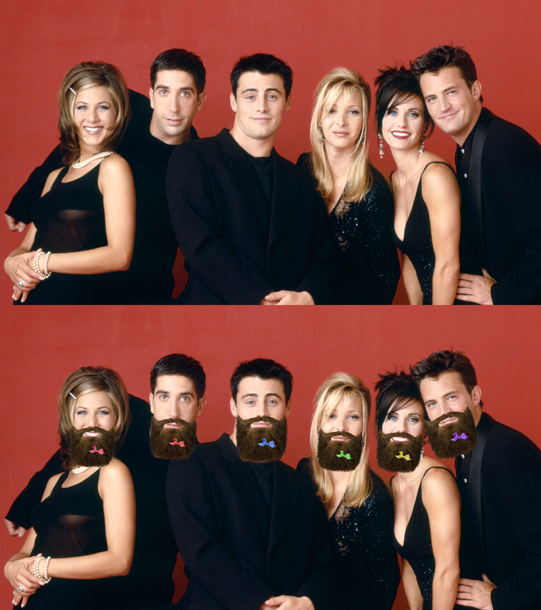

SpillyBeard
---
Commandline tool / library to make your friend look like famous DJ [Spilly Willy](https://soundcloud.com/spilly-willy).


```
$ spillybeard --help
Usage: spillybeard [OPTIONS] COMMAND [ARGS]...

         __
      .-'  |        _____       _ ____      ____                      __
     /   <\|       / ___/____  (_) / /_  __/ __ )___  ____ __________/ /
    /     \'       \__ \/ __ \/ / / / / / / __  / _ \/ __ `/ ___/ __  /
    |_.- o-o      ___/ / /_/ / / / / /_/ / /_/ /  __/ /_/ / /  / /_/ /
    / C  -._)\   /____/ .___/_/_/_/\__, /_____/\___/\__,_/_/   \__,_/
   /',  >o<   |      /_/          /____/
  |   `-,_,__,'                                             Nice beard.

Options:
  --help  Show this message and exit.

Commands:
  before-and-after  Show your pals their Spilly potential.
  embearden         Slap a SpillyBeard on that mug.

```


## Install
You'll need `cmake` to install `spillybeard`.
```
brew install cmake && pip install .
```

## Usage
```
spillybeard embearden --help
Usage: spillybeard embearden [OPTIONS] FILEPATH

  Slap a SpillyBeard on that mug.

Options:
  -o, --output PATH               A place to keep bearded pics of your
                                  friendos.
  -s, --style [real|mask|nomouth|mouth|derp]
                                  Which beard style you want.
  --help                          Show this message and exit.
```


```
spillybeard before-and-after --help
Usage: spillybeard before-and-after [OPTIONS] FILEPATH

  Show your pals their Spilly potential.

Options:
  -o, --output PATH               A place to keep bearded pics of your
                                  friendos.
  -s, --style [real|mask|nomouth|mouth|derp]
                                  Which beard style you want.
  --vertical / --horizontal       You want ontop-guy, or a side-dealio?
  --help                          Show this message and exit.
```


## CLI
```
$ spillybeard embearden ~/pics/cutefrens/will_without_a_beard.jpeg
```

## Library
```python
$ python
Python 3.9.2 (default, Mar 26 2021, 23:27:12) 
[Clang 12.0.0 (clang-1200.0.32.29)] on darwin
Type "help", "copyright", "credits" or "license" for more information.
>>> import spillybeard
>>> beardo = spillybeard.embearden("~/pics/will_without_a_beard.jpeg")
>>> beardo.show()  # Optional
>>> beardo.save("/tmp/will_normal.png")
```

## Examples



